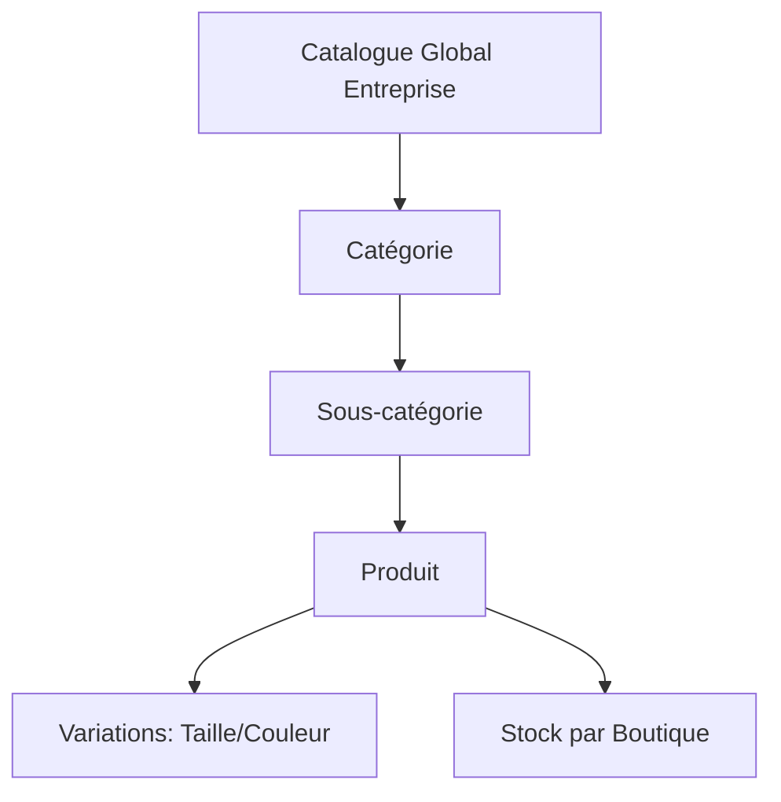
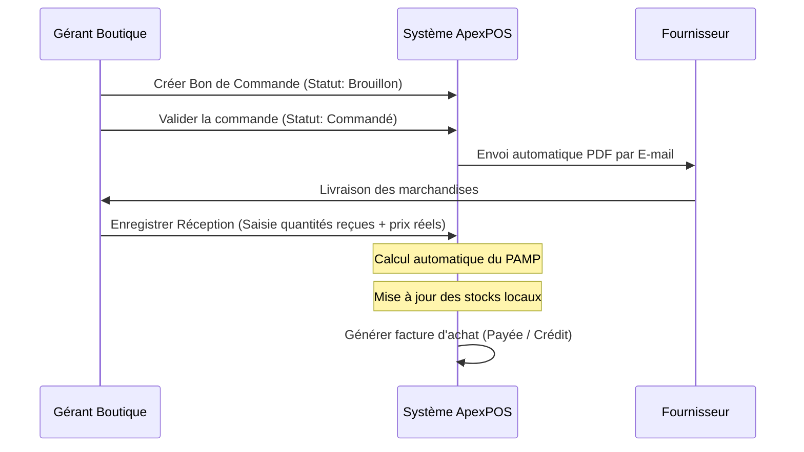
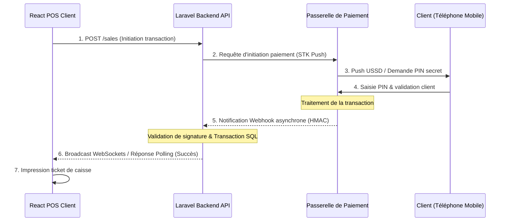
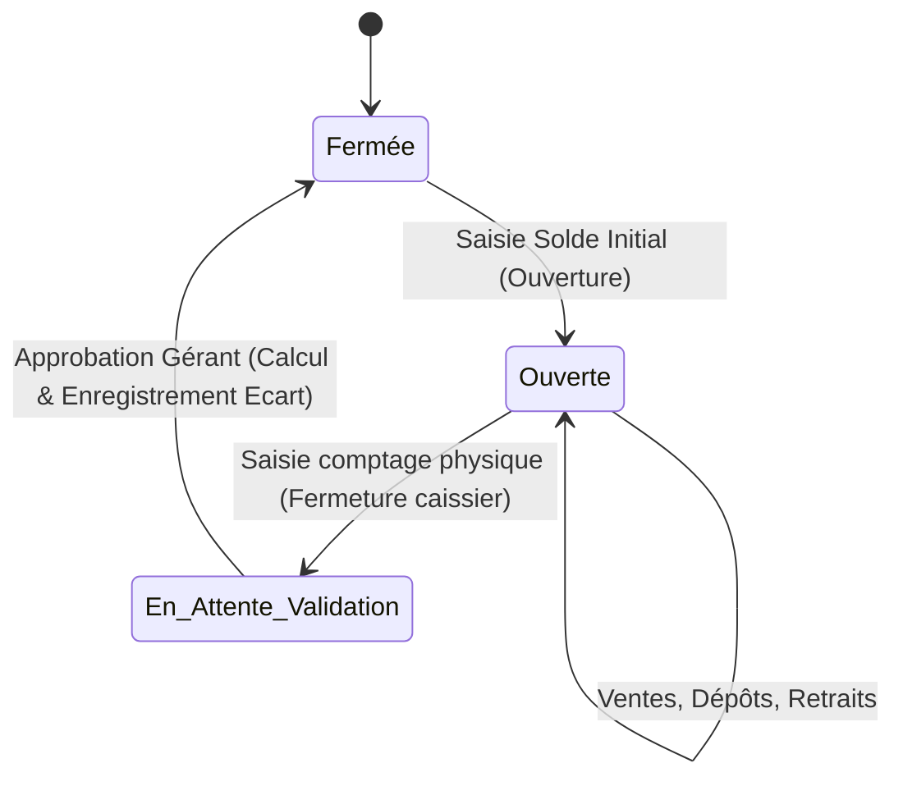
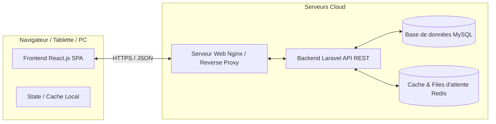
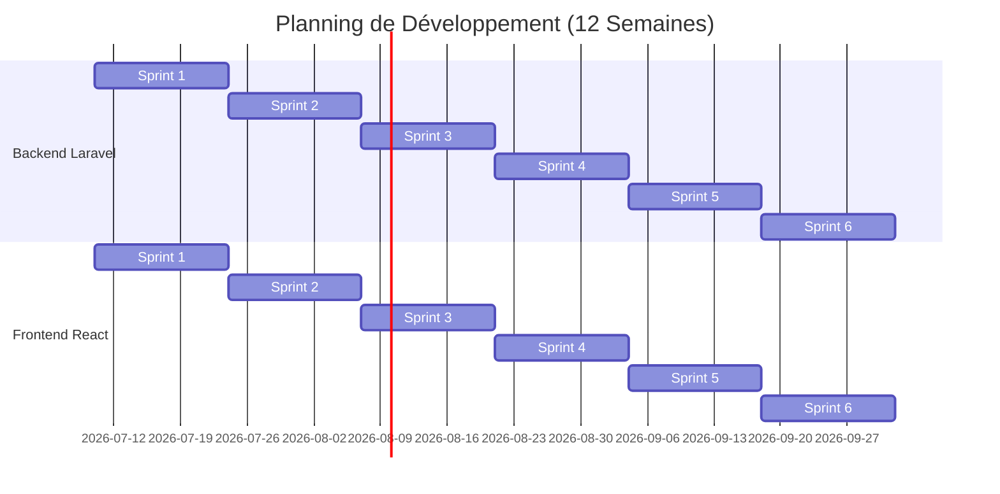

# Cahier des Charges Fonctionnel et Technique
## Projet : Application Professionnelle de Gestion de Points de Vente (POS) Multi-Entreprise & Multi-Boutiques

---

## 1. Présentation du Projet
Le projet consiste à concevoir une solution logicielle SaaS (Software as a Service) de **Point de Vente (POS)** et de gestion commerciale moderne, performante et hautement sécurisée. Baptisée **ApexPOS**, cette plateforme est structurée pour fonctionner en mode multi-entreprise (multi-tenant) et multi-boutiques (multi-point de vente).

Chaque entreprise cliente peut configurer et piloter plusieurs points de vente physiques à partir d'un espace d'administration centralisé. Le système permet de gérer de manière cloisonnée ou centralisée les stocks, les ventes, les approvisionnements, le personnel, et les données financières de chaque entité. 

L'architecture technique repose sur un découpage strict entre une interface utilisateur riche et réactive en **React.js** et un moteur API REST robuste développé avec le framework **Laravel (PHP)**, s'appuyant sur une base de données relationnelle **MySQL**.

---

## 2. Contexte et Problématique
Les commerces physiques de toute taille (quincailleries, supermarchés, pharmacies, boutiques de mode, restaurants) font face à plusieurs défis opérationnels majeurs :
* **Cloisonnement des données :** Difficulté à suivre en temps réel les performances de plusieurs boutiques distantes.
* **Erreurs d'inventaire :** Divergences fréquentes entre le stock théorique et le stock réel dues à une mauvaise traçabilité des ventes, des pertes et des transferts de marchandises.
* **Lenteur d'exécution en caisse :** Les systèmes traditionnels manquent d'ergonomie tactile et de raccourcis, ce qui allonge les files d'attente.
* **Paiements fragmentés :** Difficulté à réconcilier les paiements en espèces, cartes bancaires et surtout les services de Mobile Money (Wave, Orange Money, MTN, Moov) très répandus en Afrique de l'Ouest et centrale.
* **Instabilité réseau :** Les pannes d'internet bloquent souvent les applications entièrement cloud, d'où la nécessité d'une application résiliente qui préserve la continuité de service locale.

**ApexPOS** résout ces problématiques en fournissant une plateforme cloud réactive, dotée d'un module de caisse optimisé pour une saisie ultra-rapide (tactile et code-barres), connectable aux passerelles de Mobile Money locales, et conçue pour être tolérante aux micro-déconnexions.

---

## 3. Objectifs
* **Centralisation multi-sites :** Permettre aux chefs d'entreprise de superviser l'ensemble de leurs points de vente, stocks et employés depuis un tableau de bord unique.
* **Fluidité d'encaissement :** Garantir un temps de traitement d'un panier client inférieur à 5 secondes pour un caissier qualifié grâce à une interface POS optimisée.
* **Gestion des stocks en temps réel :** Assurer une visibilité immédiate du niveau de stock par boutique, avec alertes de stock bas pour automatiser les réapprovisionnements.
* **Traçabilité totale (Audit) :** Réduire la démarque inconnue et la fraude interne grâce à un journal d'audit cryptographique non modifiable de toutes les transactions critiques.
* **Flexibilité financière :** Gérer les paiements multiples (mixtes) et le crédit client de manière rigoureuse.
* **Scalabilité et Robustesse :** Proposer une architecture logicielle modulaire permettant d'ajouter des modules métier (ex. module restaurant avec gestion des tables) sans réécriture du noyau.

---

## 4. Analyse des Besoins Fonctionnels et Non Fonctionnels

### 4.1 Besoins Fonctionnels (BF)
* **BF-01 : Multi-Tenancy (Cloisonnement) :** Séparation stricte des données entre les différentes entreprises.
* **BF-02 : Gestion Multi-Boutiques :** Possibilité pour une entreprise de créer $N$ points de vente.
* **BF-03 : Terminal de Vente Tactile (POS) :** Interface d'encaissement rapide avec gestion du panier, lecture de codes-barres, mise en attente de tickets et raccourcis clavier.
* **BF-04 : Gestion Financière de Caisse :** Processus rigide d'ouverture, dépôts, retraits et fermeture de caisse avec calcul automatique de l'écart de caisse.
* **BF-05 : Gestion des Approvisionnements et Fournisseurs :** Enregistrement des achats, calcul du Prix Moyen Pondéré (PAMP) et suivi du crédit fournisseur.
* **BF-06 : Gestion des Stocks et Transferts :** Suivi des mouvements, valorisation de l'inventaire et transferts sécurisés entre boutiques.
* **BF-07 : Programme de Fidélité et Crédit Client :** Fiche client avec historique, compte courant de crédit et cumul de points de fidélité.
* **BF-08 : Rapports Analytiques :** Génération de statistiques de vente, de marge et d'états financiers exportables.

### 4.2 Besoins Non Fonctionnels (BNF)
* **BNF-01 : Performance :** 
  * Temps de réponse des API de lecture inférieures à 100ms.
  * Temps d'ajout d'un produit au panier POS inférieur à 16ms (60fps pour éviter toute latence visuelle).
* **BNF-02 : Sécurité :**
  * Authentification forte via jetons sécurisés.
  * Chiffrement des communications en transit (HTTPS / TLS 1.3).
  * Masquage et hachage des données sensibles (mots de passe via bcrypt).
* **BNF-03 : Ergonomie & Accessibilité :**
  * Interface "Mobile-First" pour les gérants et "Tablet/Desktop-First" pour le terminal de caisse.
  * Mode sombre disponible pour réduire la fatigue visuelle des caissiers travaillant en horaires décalés.
* **BNF-04 : Disponibilité et Résilience :**
  * Taux de disponibilité cible de 99.9%.
  * Mécanisme de cache local (IndexedDB) pour permettre au POS de continuer à fonctionner temporairement en cas de déconnexion réseau intermittente.
* **BNF-05 : Extensibilité :** Code source structuré selon les principes SOLID et documenté via OpenAPI / Swagger.

---

## 5. Description Détaillée des Acteurs et de leurs Permissions

L'application utilise un modèle de contrôle d'accès basé sur les rôles (RBAC - Role-Based Access Control). Chaque utilisateur est affecté à un rôle précis au sein d'une entreprise ou au niveau global (SaaS).

| Rôle | Périmètre d'action | Permissions clés |
| :--- | :--- | :--- |
| **Super-Admin (SaaS)** | Système global | Gérer les entreprises clientes, suivre les abonnements, administrer les paramètres généraux de la plateforme SaaS, accéder au journal d'audit global. |
| **Administrateur Entreprise** | Toute l'entreprise | Gérer tous les points de vente, créer des utilisateurs, modifier les rôles, gérer le catalogue de produits global, configurer les paramètres de l'entreprise, consulter tous les rapports financiers et marges. |
| **Gérant de Boutique** | Un ou plusieurs points de vente assignés | Gérer le stock local, approuver les transferts de stock reçus, gérer les achats locaux, ouvrir/fermer et auditer toutes les caisses de sa boutique, consulter les rapports de vente de sa boutique. |
| **Caissier** | Caisse assignée uniquement | Ouvrir sa session de caisse, scanner des produits, appliquer des remises limitées (selon politique), encaisser les paiements, mettre des paniers en attente, fermer sa propre caisse. |
| **Comptable** | Données financières de l'entreprise | Consulter les rapports de ventes, d'achats, de taxes et de marges, valider les factures fournisseurs, éditer les journaux d'écritures pour la comptabilité externe. |

---

## 6. Gestion des Entreprises
Ce module gère l'enregistrement et la configuration globale des comptes d'entreprises (tenants).

### 6.1 Règles de Gestion & Fonctionnalités
* **Cloisonnement strict (Multi-tenancy) :** Chaque table de la base de données contenant des données métier doit posséder une clé étrangère `company_id`. Les requêtes SQL doivent systématiquement filtrer sur cette clé pour éviter toute fuite de données entre entreprises.
* **Paramétrage fiscal :** L'entreprise définit sa devise de référence (ex. CFA, EUR, USD), son format de taxes par défaut (TVA applicable, taxes sur les boissons, etc.), et son fuseau horaire.
* **Branding :** Téléchargement du logo de l'entreprise et personnalisation des entêtes/pieds de page des documents légaux (factures, reçus).
* **Cycle de vie du compte :** Gestion des états de l'entreprise : `Actif`, `Suspendu` (défaut de paiement d'abonnement SaaS), `Archivé`. Si une entreprise est suspendue, tous ses utilisateurs se voient refuser l'accès aux API.

---

## 7. Gestion des Points de Vente (Boutiques)
Une entreprise peut posséder plusieurs boutiques ou entrepôts physiques.

### 7.1 Règles de Gestion & Fonctionnalités
* **Indépendance des stocks :** Chaque point de vente dispose de son propre inventaire physique. Un produit peut être en stock dans la boutique A et en rupture dans la boutique B.
* **Personnalisation locale :** Chaque point de vente possède sa propre adresse, ses numéros de téléphone de contact et ses propres terminaux de caisse associés.
* **Affectation du personnel :** Un caissier est généralement rattaché à un unique point de vente pour une période donnée afin de simplifier la gestion des accès et de la responsabilité des caisses. Un gérant peut superviser plusieurs boutiques.
* **Reçus personnalisés :** Configuration des informations spécifiques à imprimer sur le ticket de caisse local (Message de bienvenue, politique de retour locale, coordonnées de la boutique).

---

## 8. Gestion des Utilisateurs
Ce module gère les comptes des collaborateurs de l'entreprise.

### 8.1 Règles de Gestion & Fonctionnalités
* **Identification unique :** L'adresse e-mail ou un identifiant court (pour le POS rapide) sert d'identifiant unique de connexion.
* **Code PIN de caisse :** En plus du mot de passe standard pour l'interface d'administration, les caissiers disposent d'un code PIN à 4 chiffres permettant un déverrouillage ultra-rapide du terminal de caisse physique sans ressaisie du mot de passe complet.
* **Rattachement géographique :** Lors de sa création, l'utilisateur est lié à une entreprise (`company_id`) et associé à un ou plusieurs points de vente autorisés (`branch_id`).
* **Historique des sessions :** Enregistrement de l'adresse IP, du navigateur, de l'heure de connexion et de déconnexion pour chaque session utilisateur.

---

## 9. Gestion des Rôles et Permissions
Le système implémente un contrôle d'accès fin et dynamique (RBAC).

### 9.1 Règles de Gestion & Fonctionnalités
* **Permissions granulaires :** Les actions de l'API sont protégées par des clés de permission spécifiques (ex. `products.create`, `sales.apply-discount`, `cash-register.force-close`).
* **Héritage et personnalisation :** L'administrateur de l'entreprise peut utiliser des rôles prédéfinis ou créer des rôles personnalisés en cochant la liste des permissions autorisées.
* **Contrôle d'accès au niveau de l'API :** Laravel Sanctum valide le jeton de l'utilisateur, puis un middleware vérifie si le rôle de l'utilisateur contient la permission requise pour la route appelée.
* **Mise à jour en temps réel :** En cas de modification des permissions d'un rôle, les sessions actives des utilisateurs concernés doivent être rafraîchies ou invalidées pour appliquer immédiatement les nouvelles restrictions.

---

## 10. Gestion des Catégories, Sous-catégories et Produits
Ce module constitue le référentiel (catalogue) des articles mis en vente.



### 10.1 Types de Produits supportés
1. **Produit Standard :** Article physique avec gestion des stocks unitaire (ex. Marteau, Paquet de ciment).
2. **Produit Variable :** Article disposant de déclinaisons (ex. T-shirt avec variations de taille et couleur, partageant la même fiche mais ayant des codes-barres et des stocks distincts).
3. **Service / Produit Dématérialisé :** Article sans gestion de stock physique (ex. Main d'œuvre d'installation, recharge de crédit téléphonique).
4. **Kit / Produit Composé :** Lot regroupant plusieurs produits standards (ex. Kit Outillage contenant 1 marteau + 1 boîte de clous). La vente du kit décrémente automatiquement le stock des composants individuels.

### 10.2 Attributs d'un Produit
* `UUID` / `ID` unique.
* `SKU` (Stock Keeping Unit) : Référence interne générée automatiquement ou saisie manuellement.
* `Code-barres` : Support des formats EAN-13, UPC, Code 128. Génération automatique possible par le système.
* `Désignation` / `Nom` du produit.
* `Description` textuelle et `Image` (stockée sur S3).
* `Prix d'achat HT` et `Prix d'achat TTC` (calculé).
* `Prix de vente HT` et `Prix de vente TTC` (calculé selon la taxe).
* `Marge bénéficiaire` (calculée automatiquement : $\text{Prix de vente HT} - \text{Prix d'achat HT}$).
* `Taux de taxe` applicable (ex. TVA 18%).
* `Seuil d'alerte de stock` (pour déclencher les notifications de réapprovisionnement).
* `Unité de mesure` (Pièce, Kilogramme, Litre, Mètre).
* Indicateur `Vente à la pesée` : Si actif, le POS demande le poids de l'article lors de la saisie (intégration avec balance).

---

## 11. Gestion des Fournisseurs
Le référentiel des partenaires commerciaux auprès desquels l'entreprise s'approvisionne.

### 11.1 Règles de Gestion & Fonctionnalités
* **Fiche Fournisseur complète :** Raison sociale, code fournisseur unique, numéro de TVA, téléphone, adresse email de contact, et coordonnées bancaires.
* **Compte Courant Fournisseur :** Suivi en temps réel des dettes de l'entreprise envers le fournisseur. Tout achat à crédit augmente ce solde débiteur, tout paiement enregistré le diminue.
* **Évaluation des performances :** Statistiques sur les délais de livraison réels constatés par rapport aux promesses, taux d'erreur de livraison (articles manquants ou endommagés).

---

## 12. Gestion des Achats
Processus d'approvisionnement des produits pour alimenter les stocks.



### 12.1 Règles de Gestion & Calcul du PAMP
* **Valorisation par le Prix Moyen Pondéré (PAMP) :** Lors de la réception d'un lot de produits à un coût d'achat unitaire différent du coût actuel, le système recalcule la valeur moyenne du stock :
  $$\text{Nouveau PAMP} = \frac{(\text{Stock Actuel} \times \text{PAMP Actuel}) + (\text{Quantité Reçue} \times \text{Prix d'Achat Unitaire Récit})}{\text{Stock Actuel} + \text{Quantité Reçue}}$$
* **Gestion des écarts de livraison :** Si la quantité reçue est inférieure à la quantité commandée, le système génère un reliquat de commande ou clôture la commande avec mention "Partiellement reçue" et ajuste la facture en conséquence.
* **Traçabilité des prix :** Historisation de l'évolution des prix d'achat pour chaque produit afin de tracer l'inflation ou les variations de marges.

---

## 13. Gestion des Stocks
Suivi physique et financier des marchandises présentes dans chaque point de vente.

### 13.1 Mouvements de Stock et États
Chaque modification de stock doit faire l'objet d'une ligne d'écriture dans la table `stock_movements` (Double entrée pour traçabilité). Les types de mouvements autorisés sont :
* `ACHAT` : Entrée de stock suite à une commande fournisseur validée.
* `VENTE` : Sortie de stock suite à un ticket de caisse validé au POS.
* `RETOUR_CLIENT` : Réintégration de stock suite à un retour produit accepté.
* `RETOUR_FOURNISSEUR` : Sortie de stock pour renvoi de marchandise défectueuse.
* `TRANSFERT_ENTRANT` / `TRANSFERT_SORTANT` : Mouvements inter-boutiques.
* `AJUSTEMENT` : Correction manuelle suite à un inventaire physique (perte, casse, vol, erreur de saisie).

### 13.2 Règles de Gestion de l'Inventaire (Ajustement)
* **Inventaire tournant ou annuel :** Le gérant peut figer temporairement les ventes d'un rayon pour effectuer un comptage.
* **Validation de l'ajustement :** Un ajustement de stock entraînant une baisse de valeur financière supérieure à un seuil défini (ex. 50 000 CFA) doit obligatoirement être validé par l'Administrateur Entreprise.
* **Alerte automatique :** Dès que le stock physique disponible d'un produit passe sous le `alert_threshold`, une notification système et un e-mail sont générés à l'attention du gérant.

---

## 14. Gestion des Transferts de Stock
Mouvements logistiques sécurisés entre deux points de vente de la même entreprise.

### 14.1 Règles de Gestion du Processus de Transfert
1. **Initiation :** La boutique Source ou la boutique Destination crée une demande de transfert spécifiant les produits et les quantités. Le statut est `En attente d'expédition`.
2. **Expédition :** La boutique Source valide la sortie des produits. Les stocks de la boutique Source sont immédiatement décrémentés et placés dans un statut virtuel de stock `En transit`.
3. **Réception :** À l'arrivée des marchandises, la boutique Destination effectue un contrôle quantitatif et qualitatif.
4. **Validation :**
   * *Si conformité totale :* La boutique Destination valide le transfert. Le stock `En transit` est versé dans le stock disponible de la boutique Destination. Le statut devient `Complété`.
   * *Si écart (manquant/casse) :* Le gérant saisit les quantités réellement reçues et déclare l'écart. Le système crédite le stock disponible de la destination uniquement pour les produits reçus conformes, et enregistre l'écart dans les pertes de l'entreprise sous le motif `Perte en Transit`. Le statut devient `Complété avec écart`.

---

## 15. Gestion Complète des Ventes (POS)
Le terminal de point de vente (POS) est l'écran le plus critique de l'application. Il doit être conçu pour une utilisation intensive sous haute pression.

### 15.1 Fonctionnalités Clés de l'Interface POS
* **Panier Actif et Multi-Paniers :** Possibilité d'ouvrir plusieurs paniers simultanément (ex. mettre en attente la vente en cours pour servir un client qui a oublié son portefeuille et passer au client suivant, puis récupérer le panier initial).
* **Saisie ultra-rapide :**
  * Scan de code-barres : La saisie d'un code-barres via une douchette (qui simule une saisie clavier suivie de la touche `Entrée`) doit ajouter instantanément le produit au panier.
  * Recherche prédictive : Recherche par nom ou SKU avec affichage des résultats en moins de 50ms.
  * Clavier virtuel numérique intégré à l'écran pour les écrans tactiles.
* **Gestion des remises :** Remise en pourcentage (%) ou en valeur absolue (devise) applicable sur un article spécifique ou sur la totalité du panier. L'application des remises est limitée par le rôle de l'utilisateur (ex. le caissier peut faire max 5%, le gérant max 20%, l'administrateur sans limite).
* **Calculateur de rendu de monnaie :** Saisie du montant donné par le client (avec boutons d'accès rapide pour les billets courants, ex. 5 000, 10 000 CFA), calcul immédiat et affichage en gros caractères du montant à rendre.

---

## 16. Gestion des Paiements
ApexPOS supporte une grande variété de modes de paiement pour s'adapter à tous les comportements d'achat, notamment à travers l'intégration d'une API/Passerelle de paiement.

### 16.1 Règles de Gestion par Mode de Paiement
* **Espèces (Cash) :** Le mode de paiement par défaut. Les flux d'espèces doivent alimenter directement le solde de la caisse physique active.
* **Carte Bancaire (TPE) :** Saisie du numéro de transaction ou liaison directe avec le terminal de paiement.
* **Mobile Money (Wave, Orange Money, MTN Money, Moov) :**
  * *Intégration API (Automatique) :* Envoi d'une requête push USSD / STK Push sur le téléphone du client pour validation directe par son code PIN secret.
  * *Mode Manuel (Secours) :* Si l'intégration API ou le réseau est indisponible, le caissier saisit manuellement la référence de transaction SMS reçue sur le téléphone de la boutique.
* **Paiement Mixte (Multi-Paiement) :** Possibilité de diviser le règlement d'une facture. *Exemple : Une facture de 15 000 CFA payée avec 5 000 CFA en espèces et 10 000 CFA via Wave.*
* **Vente à Crédit (Compte Client) :** Autorisé uniquement pour les clients enregistrés dont l'encours de crédit n'a pas dépassé le plafond autorisé. Le montant de la vente est imputé au solde débiteur du client.

### 16.2 Intégration Technique de l'API de Paiement
L'application s'interface avec l'API de paiement **GeniusPay** (https://geniuspay.com) pour centraliser les flux Mobile Money et cartes bancaires.



#### A. Cycle de vie de la Transaction
1. **Initiation (STK Push) :** Lors du clic sur le mode de paiement Mobile Money au POS, l'API Laravel envoie une requête à la passerelle de paiement contenant : le montant, la devise, une référence interne de transaction unique (`transaction_id`), le numéro du client et l'URL du Webhook de callback.
2. **Attente active (Polling) & Temps réel :** 
   * L'application React ouvre une connexion WebSocket (via **Laravel Echo** et **Pusher/Reverb**) sur le canal privé de la session de caisse pour écouter l'événement de réussite du paiement.
   * En secours, si les WebSockets sont bloqués par le pare-feu du réseau local, React effectue un *polling* HTTP (requête GET toutes les 3 secondes vers `/api/v1/payments/{transaction_id}/status`) pendant une durée maximale de 60 secondes.
3. **Webhook de confirmation :** Dès que le client valide le paiement sur son mobile, la passerelle de paiement appelle l'API publique `/api/v1/payments/webhook`.
4. **Finalisation transactionnelle :** Lors de la confirmation (succès) du paiement par le Webhook, Laravel exécute une transaction de base de données (ACID) :
   * Met à jour le statut du paiement en `paid`.
   * Crée la vente (`sales`) et ses lignes de vente (`sale_items`).
   * Décrémente les stocks réels dans `inventory`.
   * Enregistre le mouvement de stock `VENTE`.
   * Crédite les points de fidélité du client.

#### B. Règles de Sécurité et Résilience
* **Signature HMAC-SHA256 :** L'endpoint du Webhook valide la signature envoyée dans les entêtes de la requête (header `X-Sign` ou similaire) en la recalculant à l'aide d'une clé secrète partagée. Les requêtes non signées ou à signature invalide sont immédiatement rejetées avec un code HTTP 401.
* **Dédoublonnement (Idempotence) :** Pour éviter qu'un webhook appelé deux fois par erreur n'enregistre deux ventes ou ne décrémente deux fois les stocks, Laravel utilise la table des transactions pour vérifier si la référence unique (`transaction_id`) a déjà été traitée avant d'exécuter la logique métier.
* **Réconciliation (Fallback) :** Un Job d'arrière-plan planifié s'exécute toutes les nuits pour vérifier auprès de l'API de paiement le statut de toutes les transactions restées au statut `pending` depuis plus de 30 minutes, afin de réconcilier les éventuels webhooks perdus en cours de route.

---

## 17. Gestion des Retours et Remboursements
Traitement des réclamations clients après finalisation de la vente.

### 17.1 Règles de Gestion & Sécurité
* **Liaison obligatoire à un ticket :** Aucun retour ou remboursement ne peut être effectué sans référence à un ticket de caisse initial valide présent dans la base de données.
* **Délais de retour :** Le système vérifie que le délai maximum de retour paramétré par l'entreprise (ex. 15 jours) n'est pas dépassé.
* **Modes de compensation :**
  * *Remboursement direct :* Sortie de fonds de la caisse (espèces) ou remboursement sur la carte/compte mobile initial.
  * *Avoir client (Credit Note) :* Génération d'un bon d'achat unique doté d'un code-barres utilisable comme moyen de paiement lors d'une prochaine vente.
* **Destinées du produit retourné :** Lors du retour, le caissier doit spécifier l'état de l'article :
  * `Remis en stock` : L'article est conforme, le stock disponible est incrémenté.
  * `Défectueux / À détruire` : L'article est endommagé, il est envoyé dans le stock des rebus et n'est pas réintégré au stock de vente.

---

## 18. Gestion des Clients et Programme de Fidélité
Suivi de la clientèle et stratégies de fidélisation.

### 18.1 Fiche Client et Crédit
* **Données collectées :** Nom, prénom, téléphone (clé d'identification unique en boutique), e-mail, adresse.
* **Gestion du risque de crédit :** L'administrateur définit pour chaque client ou groupe de clients :
  * `credit_limit` : Montant maximal de dette autorisé (ex. 200 000 CFA). Si dépassé, le POS bloque toute nouvelle vente à crédit pour ce client.
  * `due_date_limit` : Nombre de jours maximum pour régler les factures (ex. 30 jours).
* **Groupes tarifaires :** Association du client à un groupe (ex. Détaillant, Grossiste, VIP) appliquant automatiquement une grille de prix spécifique lors de la saisie de son nom dans le POS.

### 18.2 Programme de Fidélité (Loyalty Program)
* **Algorithme de cumul :** L'entreprise configure le taux de conversion (ex. 1 000 CFA dépensés = 1 point cumulé).
* **Algorithme de conversion :** Définition de la valeur d'un point (ex. 1 point = 10 CFA de réduction).
* **Validation des paliers :** Les points accumulés peuvent être convertis en bon d'achat ou appliqués en réduction directe sur le panier lors du passage en caisse, uniquement si le client est présent et identifié.

---

## 19. Gestion des Caisses (Sessions de Caisse)
La gestion des caisses assure le contrôle des flux financiers physiques manipulés par les caissiers.



### 19.1 Cycle de Vie d'une Session de Caisse
1. **Ouverture de Caisse :** Au début de son quart de travail, le caissier doit obligatoirement ouvrir sa session en saisissant le montant réel des espèces présentes dans son tiroir (fond de caisse initial). Le système crée une ligne dans `cash_sessions` avec le statut `Ouverte`.
2. **Opérations de flux (Transactions de caisse) :**
   * *Entrées automatiques :* Ventes en espèces.
   * *Dépôts manuels (Cash In) :* Ajout de fonds en cours de journée (ex. apport de monnaie par le gérant).
   * *Retraits manuels (Cash Out) :* Sortie de fonds (ex. paiement d'un coursier, dépôt de sécurité à la banque). Chaque retrait doit être documenté avec un motif obligatoire.
3. **Fermeture de Caisse (Soumission) :** En fin de journée, le caissier procède au comptage physique de son tiroir-caisse. Il saisit les montants par mode de paiement (Espèces physiques comptées, tickets de carte bancaire, totaux Wave). Le système calcule immédiatement la différence entre le théorique attendu (calculé par le système) et le physique déclaré. La session passe au statut `En attente de validation`.
4. **Approbation et Clôture :** Le gérant de boutique vérifie les comptes et valide la fermeture.
   * *Écart de caisse :* Si un écart est constaté ($\text{Physique} \neq \text{Théorique}$), il est enregistré en perte ou gain d'écart de caisse imputé à la session. Le statut final devient `Fermée`.

---

## 20. Tableaux de Bord selon les Rôles
Les tableaux de bord de l'application React affichent des widgets d'information adaptés aux besoins spécifiques de chaque profil utilisateur.

### 20.1 Dashboard Super-Admin (SaaS)
* **Indicateurs clés (KPIs) :** Chiffre d'affaires récurrent mensuel (MRR), nombre d'entreprises actives, taux de résiliation (churn rate).
* **Graphiques :** Évolution des abonnements sur les 12 derniers mois, répartition des entreprises par formule d'abonnement.
* **Moniteurs système :** Taux de charge des serveurs, état de santé des bases de données, alertes de sécurité en cours.

### 20.2 Dashboard Administrateur Entreprise
* **Indicateurs clés (KPIs) :** Chiffre d'affaires consolidé HT et TTC, marge commerciale brute, valeur totale du stock global, nombre de transactions totales.
* **Graphiques :** Ventes comparatives par point de vente, courbe de tendance du CA mensuel, top 10 des produits générant le plus de marge.
* **Alertes :** Liste consolidée des produits en rupture ou sous le seuil d'alerte dans l'ensemble des boutiques.

### 20.3 Dashboard Gérant de Boutique
* **Indicateurs clés (KPIs) :** CA du jour de la boutique, nombre de paniers moyens, montant du panier moyen, nombre de caisses actives.
* **Graphiques :** Heures de pointe des ventes (nombre de tickets par heure), performance de vente par caissier de la boutique.
* **Suivi opérationnel :** Demandes de transfert de stock en attente d'approbation, réceptions d'achats planifiées pour la journée.

### 20.4 Dashboard Caissier
* **Indicateurs clés (KPIs) :** Total des ventes réalisées sur sa session active, temps moyen de traitement d'un panier, montant total estimé des espèces dans son tiroir.
* **Indicateurs de progression :** Objectif de vente quotidien personnel sous forme de jauge circulaire interactive.

---

## 21. Rapports et Statistiques
Ce module permet d'extraire des données agrégées pour l'analyse financière et décisionnelle de l'entreprise.

### 21.1 Liste des Rapports Standards
* **Rapport de Ventes détaillé :** Filtrable par période (date à date), boutique, caissier, client, catégorie de produit et mode de paiement.
* **Rapport de Marge bénéficiaire :** Calculé sur la base du coût d'achat (PAMP) au moment de la vente par rapport au prix de vente réel appliqué (après remise).
* **Rapport des Taxes (TVA) :** Ventilation des ventes par taux de TVA (ex. 0%, 5%, 18%) pour faciliter les déclarations fiscales mensuelles.
* **Rapport des Pertes et Démarque inconnue :** Compilation des sorties de stock manuelles (casse, vol, obsolescence) avec valeur financière associée.
* **Rapport de Crédit Client (Balance Âgée) :** Liste des clients débiteurs classés par ancienneté de leur dette (moins de 30 jours, 30 à 60 jours, plus de 60 jours).

### 21.2 Fonctionnalités techniques d'export
* Génération de PDF hautement stylisés à l'aide d'une mise en page épurée pour l'impression ou l'archivage.
* Export brut au format Excel / CSV avec formatage des nombres et dates respectant les standards internationaux.
* Chargement asynchrone des rapports lourds (plus de 100 000 lignes) avec file d'attente Laravel (Queue Jobs) et notification par email du lien de téléchargement une fois le fichier généré.

---

## 22. Système de Notifications
ApexPOS maintient les collaborateurs informés des événements importants du système via trois canaux de distribution : *In-App*, *Email*, et *SMS*.

### 22.1 Matrice de routage des notifications

| Événement | Cible | Canal par défaut | Action attendue |
| :--- | :--- | :--- | :--- |
| **Stock sous le seuil d'alerte** | Gérant Boutique | In-App + Email | Lancer une commande d'achat |
| **Tentative de connexion suspecte** | Utilisateur concerné | Email | Vérifier ou réinitialiser le mot de passe |
| **Demande de transfert de stock** | Gérant Boutique Destination | In-App | Valider la réception physique |
| **Solde de caisse anormalement élevé** | Gérant Boutique | In-App (Alerte rouge) | Effectuer un retrait de caisse vers le coffre |
| **Facture à crédit en retard** | Client final | SMS | Relance de paiement automatique |
| **Abonnement SaaS arrivant à expiration**| Administrateur Entreprise| In-App + Email | Procéder au renouvellement |

---

## 23. Sécurité
L'application manipulant des flux financiers et des stocks de valeur, des mesures de sécurité draconiennes doivent être appliquées à tous les niveaux de l'architecture.

### 23.1 Authentification et Sessions (Laravel Sanctum vs JWT)
> [!IMPORTANT]
> **Choix recommandé : Laravel Sanctum.**
> Pour une application Web moderne de type Single Page Application (React) communiquant avec son API (Laravel), Laravel Sanctum est vivement recommandé par rapport aux architectures JWT traditionnelles pour les raisons suivantes :
> 1. **Protection CSRF native :** Sanctum utilise les cookies de session cryptés et signés de Laravel, ce qui protège nativement l'application contre les attaques de type CSRF (Cross-Site Request Forgery). Les jetons JWT stockés dans le `localStorage` de React sont quant à eux vulnérables aux attaques XSS.
> 2. **Simplicité de gestion du cycle de vie :** Sanctum permet de révoquer facilement des tokens depuis le serveur à tout moment (ex. en cas de vol de terminal ou de deces de l'employé).
> 3. **Support multi-usages :** Sanctum permet à la fois de gérer l'authentification sécurisée par cookies pour le frontend React web principal, et l'authentification par jeton Bearer Token pour les terminaux mobiles de caisse ou les intégrations externes.

### 23.2 Mesures de protection complémentaires
* **Rate Limiting :** Limitation du nombre de requêtes par minute par adresse IP (ex. 60 requêtes/minute pour les routes publiques comme la connexion, 500 requêtes/minute pour les routes privées de l'API) pour contrer les attaques par force brute et par déni de service (DDoS).
* **Validation stricte des entrées :** Utilisation des Form Requests Laravel pour valider et assainir tous les paramètres entrants (protection contre les injections SQL et les failles XSS).
* **Chiffrement au repos :** Chiffrement des clés d'API tierces (passerelles de paiement, services SMS) stockées dans la base de données à l'aide de la clé d'application Laravel (`APP_KEY`).

---

## 24. Journal d'Audit
Le journal d'audit assure la traçabilité absolue des actions critiques pour lutter contre la fraude interne.

### 24.1 Structure d'une entrée de journal d'audit
Chaque enregistrement dans la table `audit_logs` doit contenir :
* `id` : Identifiant unique (UUID).
* `company_id` : Clé de l'entreprise concernée.
* `user_id` : Clé de l'utilisateur ayant effectué l'action.
* `action` : Code d'action précis (ex. `product.price_updated`, `sale.deleted`, `cash_register.manual_open`).
* `auditable_type` & `auditable_id` : Modèle de données concerné (ex. `App\Models\Product`, ID: 45).
* `old_values` : Objet JSON contenant les données avant modification.
* `new_values` : Objet JSON contenant les données après modification.
* `ip_address` & `user_agent` : Identifiants réseau du terminal.
* `created_at` : Date et heure précises de l'événement.

### 24.2 Propriétés du journal d'audit
* **Non-modifiabilité :** Les routes API d'écriture (POST, PUT, DELETE) sur la ressource `/audit-logs` n'existent pas. Les enregistrements sont créés uniquement via des écouteurs d'événements internes de la base de données (Database Observers).
* **Archivage :** Les logs d'audit de plus de 90 jours sont automatiquement compressés et exportés vers un stockage froid sécurisé (S3 Glacier) pour libérer de l'espace sur la base de données de production.

---

## 25. Sauvegarde et Restauration
La perte de données transactionnelles étant inacceptable pour un commerce, une stratégie de sauvegarde rigoureuse est mise en œuvre.

### 25.1 Fréquence et Stockage des Sauvegardes
* **Sauvegarde complète de la base de données (MySQL) :** Toutes les nuits à 02:00 (heure creuse).
* **Sauvegarde incrémentielle :** Toutes les heures (sauvegarde des journaux de transactions binaires).
* **Stockage déporté :** Les fichiers de sauvegarde compressés et chiffrés sont envoyés immédiatement vers un compartiment cloud externe (Amazon S3 ou Google Cloud Storage) situé dans une région géographique différente de celle du serveur principal.
* **Durée de conservation (Retention policy) :**
  * Sauvegardes horaires : Conservées pendant 48 heures.
  * Sauvegardes quotidiennes : Conservées pendant 30 jours.
  * Sauvegardes mensuelles : Conservées pendant 1 an.

### 25.2 Plan de Reprise d'Activité (PRA)
* **Temps de récupération cible (RTO - Recovery Time Objective) :** Moins de 2 heures.
* **Perte de données maximale admissible (RPO - Recovery Point Objective) :** Moins d'une heure (grâce aux sauvegardes incrémentielles).
* **Tests de restauration :** Un script automatisé monte chaque mois un serveur MySQL temporaire de test à partir de la dernière sauvegarde S3 et valide son intégrité afin de certifier que les fichiers de sauvegarde ne sont pas corrompus.

---

## 26. Architecture Logicielle
L'application s'appuie sur un modèle découplé où le Frontend (React) et le Backend (Laravel) communiquent de manière asynchrone par des requêtes HTTP sur l'API REST.



### 26.1 Communication et Flux de données
1. **Frontend (React.js SPA) :** Gère uniquement l'affichage des écrans, les interactions utilisateur, la validation locale des formulaires, et la mise en cache des données statiques (ex. liste des produits pour le POS).
2. **Backend (Laravel API) :** Reçoit les requêtes HTTP, applique les politiques de sécurité (Sanctum/RBAC), exécute les règles de gestion métier complexes, valide les données via les transactions de base de données (pour garantir l'atomicité des écritures), et retourne des réponses normalisées au format JSON.
3. **Base de données MySQL :** Stocke les données persistantes de l'application. Elle utilise le moteur de stockage InnoDB prenant en charge les transactions ACID et les clés étrangères.
4. **Redis :** Utilisé comme cache applicatif pour accélérer les requêtes fréquentes (ex. configuration globale, permissions) et comme courtier de messages (Message Broker) pour les files d'attente de traitement asynchrone (envoi d'e-mails, calcul de rapports).

---

## 27. Structure Recommandée du Projet React
Le projet frontend React est généré et propulsé par **Vite** pour garantir des temps de build ultra-rapides. Le code est structuré selon une approche modulaire orientée fonctionnalités ("feature-driven").

```
react-pos-app/
├── public/
│   └── assets/             # Images, icônes statiques
├── src/
│   ├── assets/             # Fichiers CSS globaux, thèmes Tailwind/Vanilla CSS
│   ├── components/         # Composants réutilisables globaux (Button, Input, Modal, Table)
│   ├── config/             # Variables d'environnement, configuration Axios
│   ├── features/           # Modules métier autonomes
│   │   ├── auth/           # Authentification (Login, mot de passe oublié)
│   │   ├── pos/            # Interface de caisse tactile
│   │   │   ├── components/ # Composants internes au POS (Cart, ProductGrid, PaymentModal)
│   │   │   ├── hooks/      # Hooks spécifiques au POS (usePosCart)
│   │   │   └── posSlice.js # State local du panier (Zustand ou Redux)
│   │   ├── products/       # Catalogue, fiches produits, variations
│   │   └── sales/          # Historique des ventes, retours
│   ├── hooks/              # Hooks personnalisés globaux (useAuth, useLocalStorage)
│   ├── layouts/            # Gabarits de page (AdminLayout, PosLayout, AuthLayout)
│   ├── routes/             # Configuration des routes (React Router v6)
│   ├── services/           # Clients d'API (Axios API wrappers)
│   ├── store/              # State managers globaux (Zustand ou Redux Toolkit)
│   ├── utils/              # Fonctions utilitaires (formatters de devises, dates)
│   ├── App.jsx             # Composant racine
│   └── main.jsx            # Point d'entrée de l'application
├── package.json
└── vite.config.js
```

---

## 28. Structure Recommandée du Projet Laravel
Le backend Laravel respecte l'architecture standard MVC mais introduit une couche de **Services** pour isoler la logique métier complexe des contrôleurs HTTP.

```
laravel-pos-api/
├── app/
│   ├── Console/            # Commandes planifiées (sauvegardes, relances crédit)
│   ├── Exceptions/         # Gestionnaire d'erreurs global personnalisé
│   ├── Http/
│   │   ├── Controllers/
│   │   │   └── API/        # Contrôleurs API REST groupés par version (V1)
│   │   │       ├── AuthController.php
│   │   │       ├── ProductController.php
│   │   │       ├── SaleController.php
│   │   │       └── BranchController.php
│   │   ├── Middleware/     # Middlewares de sécurité (Tenancy, CheckPermissions)
│   │   ├── Requests/       # Form Requests de validation stricte par ressource
│   │   └── Resources/      # API Resources pour transformer et formater les réponses JSON
│   ├── Models/             # Modèles Eloquent (Company, User, Product, Sale, etc.)
│   ├── Observers/          # Observers de base de données pour générer le journal d'audit
│   ├── Services/           # Classes contenant la logique métier pure (StockService, CashService)
│   └── Providers/
├── bootstrap/
├── config/
├── database/
│   ├── factories/          # Générateurs de fausses données pour les tests
│   ├── migrations/         # Structure des tables SQL
│   └── seeders/            # Données de base (Permissions, Super-Admin par défaut)
├── routes/
│   ├── api.php             # Définition exclusive de toutes les routes de l'API REST
│   └── console.php
├── tests/                  # Tests unitaires et d'intégration (Pest ou PHPUnit)
├── composer.json
└── artisan
```

---

## 29. Organisation des API REST (Endpoints par module)
Tous les endpoints de l'API REST retournent des données au format JSON et utilisent les codes de statut HTTP standards (200 OK, 201 Created, 400 Bad Request, 401 Unauthorized, 403 Forbidden, 422 Unprocessable Entity, 500 Internal Server Error). Les routes sont préfixées par `/api/v1/`.

### 29.1 Module d'Authentification
* `POST /api/v1/auth/login` : Authentification de l'utilisateur, retourne le cookie de session Sanctum ou le jeton d'accès + données utilisateur.
* `POST /api/v1/auth/logout` : Révocation de la session en cours.
* `GET /api/v1/auth/me` : Récupération du profil de l'utilisateur connecté avec ses droits et boutiques autorisées.

### 29.2 Module Produits
* `GET /api/v1/products` : Liste paginée des produits avec filtres (catégorie, stock bas, recherche).
* `POST /api/v1/products` : Création d'un produit (Admin uniquement).
* `GET /api/v1/products/{id}` : Détails d'un produit.
* `PUT /api/v1/products/{id}` : Modification d'un produit.
* `DELETE /api/v1/products/{id}` : Suppression logique (soft delete) d'un produit.

### 29.3 Module Ventes (POS)
* `GET /api/v1/sales` : Historique des ventes de la boutique active.
* `POST /api/v1/sales` : Enregistrement d'une nouvelle vente (création ticket + décrémentation stock + paiement).
* `GET /api/v1/sales/{id}` : Récupération des détails d'une vente pour réimpression du ticket.
* `POST /api/v1/sales/{id}/refund` : Traitement d'un retour produit ou remboursement total/partiel.

### 29.4 Module Caisses
* `GET /api/v1/cash-sessions/active` : Récupère la session de caisse active du caissier connecté.
* `POST /api/v1/cash-sessions/open` : Ouvre une nouvelle session de caisse avec un fond de caisse initial.
* `POST /api/v1/cash-sessions/transaction` : Enregistre une transaction manuelle (dépôt ou retrait de caisse).
* `POST /api/v1/cash-sessions/close` : Soumet le comptage physique pour fermer la caisse.
* `POST /api/v1/cash-sessions/{id}/validate` : Validation par le gérant de la fermeture et calcul des écarts.

### 29.5 Module Intégration de Paiements (Mobile Money & Cartes)
* `POST /api/v1/payments/initiate` : Envoie la requête STK Push à la passerelle de paiement (Wave, OM, MTN, Moov).
* `GET /api/v1/payments/{transaction_id}/status` : Permet au client React de faire du polling pour vérifier le statut de la transaction locale.
* `POST /api/v1/payments/webhook` : URL publique de rappel pour les notifications asynchrones de la passerelle (vérification HMAC requise).

---

## 30. Organisation de la Base de Données MySQL
La base de données MySQL utilise le moteur de stockage transactionnel InnoDB. Les relations sont matérialisées par des contraintes de clés étrangères avec indexation pour optimiser les performances des requêtes.

### 30.1 Liste des Entités Majeures et Clés

```
[companies] (Entreprises / Tenants)
  - id : BIGINT UNSIGNED (PK)
  - name : VARCHAR(100)
  - timezone : VARCHAR(50)
  - currency : VARCHAR(10)
  - tax_settings : JSON
  - status : ENUM('active', 'suspended', 'archived')
  - created_at / updated_at

[branches] (Points de Vente)
  - id : BIGINT UNSIGNED (PK)
  - company_id : BIGINT UNSIGNED (FK)
  - name : VARCHAR(100)
  - address : TEXT
  - phone : VARCHAR(20)
  - created_at / updated_at

[users] (Utilisateurs)
  - id : BIGINT UNSIGNED (PK)
  - company_id : BIGINT UNSIGNED (FK)
  - name : VARCHAR(100)
  - email : VARCHAR(100) (Unique)
  - password : VARCHAR(255)
  - pin_code : VARCHAR(4) (Optionnel, crypté)
  - role : VARCHAR(50)
  - status : ENUM('active', 'inactive')
  - created_at / updated_at

[products] (Catalogue Produits)
  - id : BIGINT UNSIGNED (PK)
  - company_id : BIGINT UNSIGNED (FK)
  - category_id : BIGINT UNSIGNED (FK)
  - sku : VARCHAR(50) (Unique par entreprise)
  - barcode : VARCHAR(50) (Unique)
  - name : VARCHAR(150)
  - unit : VARCHAR(20)
  - purchase_price_ht : DECIMAL(15,2)
  - sale_price_ht : DECIMAL(15,2)
  - tax_rate : DECIMAL(5,2) (ex. 18.00)
  - alert_threshold : DECIMAL(10,2)
  - is_trackable : TINYINT(1) (Gestion de stock active ou non)
  - deleted_at (Soft delete)

[inventory] (Stocks par Boutique)
  - id : BIGINT UNSIGNED (PK)
  - branch_id : BIGINT UNSIGNED (FK)
  - product_id : BIGINT UNSIGNED (FK)
  - quantity : DECIMAL(12,2) (Support des ventes au poids / fractions)
  - created_at / updated_at
  - UNIQUE KEY (branch_id, product_id)

[stock_movements] (Historique des Mouvements de Stock)
  - id : BIGINT UNSIGNED (PK)
  - branch_id : BIGINT UNSIGNED (FK)
  - product_id : BIGINT UNSIGNED (FK)
  - user_id : BIGINT UNSIGNED (FK)
  - quantity : DECIMAL(12,2) (Positif pour entrées, négatif pour sorties)
  - type : ENUM('purchase', 'sale', 'transfer_in', 'transfer_out', 'adjustment', 'return')
  - reference_id : BIGINT UNSIGNED (ID de la vente, achat ou transfert lié)
  - comment : TEXT
  - created_at

[sales] (En-tête des Ventes)
  - id : BIGINT UNSIGNED (PK)
  - company_id : BIGINT UNSIGNED (FK)
  - branch_id : BIGINT UNSIGNED (FK)
  - user_id : BIGINT UNSIGNED (FK) (Caissier)
  - client_id : BIGINT UNSIGNED (FK) (Optionnel)
  - cash_session_id : BIGINT UNSIGNED (FK)
  - ticket_number : VARCHAR(50) (Généré selon format séquentiel)
  - total_ht : DECIMAL(15,2)
  - total_tax : DECIMAL(15,2)
  - total_discount : DECIMAL(15,2)
  - total_ttc : DECIMAL(15,2)
  - status : ENUM('completed', 'refunded', 'partially_refunded')
  - created_at

[sale_items] (Lignes de Vente)
  - id : BIGINT UNSIGNED (PK)
  - sale_id : BIGINT UNSIGNED (FK)
  - product_id : BIGINT UNSIGNED (FK)
  - quantity : DECIMAL(12,2)
  - unit_price_ht : DECIMAL(15,2)
  - unit_price_ttc : DECIMAL(15,2)
  - discount : DECIMAL(15,2)
  - total_item_ttc : DECIMAL(15,2)

[payments] (Paiements de Vente)
  - id : BIGINT UNSIGNED (PK)
  - sale_id : BIGINT UNSIGNED (FK)
  - method : ENUM('cash', 'card', 'wave', 'orange_money', 'mtn_money', 'moov_money', 'credit')
  - amount : DECIMAL(15,2)
  - transaction_reference : VARCHAR(100) (Pour paiements électroniques)
  - created_at

[cash_sessions] (Sessions de Caisse)
  - id : BIGINT UNSIGNED (PK)
  - branch_id : BIGINT UNSIGNED (FK)
  - user_id : BIGINT UNSIGNED (FK)
  - opened_at : DATETIME
  - closed_at : DATETIME (Null si ouverte)
  - opening_balance : DECIMAL(15,2)
  - closing_balance_expected : DECIMAL(15,2) (Calculé par le système)
  - closing_balance_actual : DECIMAL(15,2) (Déclaré par le caissier)
  - status : ENUM('open', 'pending_validation', 'closed')
```

---

## 31. Parcours Utilisateur Détaillé (Scénarios Métier)

### Scénario A : Journée Type d'un Caissier
1. **Prise de poste :** Le caissier se connecte sur l'application Web React depuis la tablette de caisse. Il saisit son code PIN à 4 chiffres.
2. **Ouverture :** L'application lui demande de saisir le fond de caisse réel. Il compte les billets physiques (15 000 CFA), valide. L'API Laravel enregistre l'ouverture et déverrouille l'interface POS.
3. **Encaissement :** Un client se présente avec 3 articles.
   * Le caissier scanne les articles avec le lecteur de codes-barres. Ils s'ajoutent au panier instantanément.
   * Le caissier sélectionne le client dans le moteur de recherche pour lui attribuer ses points de fidélité.
   * Le client souhaite payer 2 000 CFA en espèces et le reste (8 000 CFA) via Wave.
   * Le caissier clique sur "Multi-Paiement", saisit 2 000 CFA dans le champ "Espèces", puis clique sur "Wave" pour le reste. Il initie le STK Push. Le client valide sur son téléphone.
   * Le paiement est confirmé. Le tiroir-caisse s'ouvre, le ticket de caisse s'imprime automatiquement.
4. **Fermeture de caisse :** En fin de shift, le caissier clique sur "Fermer la caisse". Il compte sa caisse physique (17 000 CFA en espèces) et soumet sa caisse. La caisse se verrouille. Il peut quitter son poste.

### Scénario B : Réception d'Achat et Mise à Jour des Stocks
1. **Création du bon de commande :** Le gérant de boutique se connecte à son espace administration. Il constate que le stock de ciment est de 5 sacs (seuil d'alerte à 10). Il génère un bon de commande de 100 sacs auprès du fournisseur "SOCIM".
2. **Livraison :** Le camion du fournisseur arrive. Le gérant vérifie les sacs. Il y a 2 sacs déchirés inutilisables.
3. **Enregistrement :** Le gérant accède à l'écran "Réception d'achats" sur l'application, sélectionne la commande. Il saisit : Quantité reçue conforme = 98, Quantité endommagée = 2.
4. **Validation :** L'API Laravel traite l'opération :
   * Augmente le stock de la boutique de 98 sacs de ciment.
   * Recalcule le PAMP du ciment.
   * Crée un mouvement de stock de type `ACHAT` pour 98 unités et un mouvement de type `AJUSTEMENT` négatif pour les 2 sacs perdus.
   * Met à jour le compte fournisseur "SOCIM" avec le montant de la facture de 98 sacs.

### Scénario C : Transfert de stock inter-boutiques
1. **Demande :** Le gérant de la Boutique A a besoin de 10 marteaux en urgence. Il émet une demande de transfert à la Boutique B.
2. **Préparation :** Le gérant de la Boutique B valide la demande, prépare le colis et clique sur "Expédier". Les 10 marteaux passent instantanément du statut "Disponible" au statut "En transit" de la Boutique B.
3. **Réception :** Le coursier livre les marteaux à la Boutique A. Le gérant de la Boutique A compte 10 marteaux, clique sur "Valider la réception". Les 10 marteaux sortent du statut "En transit" et intègrent le stock disponible de la Boutique A.

---

## 32. Liste Complète des Écrans de l'Application

### 32.1 Écrans du Portail d'Administration (React)
1. **Écran de Connexion (Auth) :** Formulaire e-mail/mot de passe et saisie de code PIN.
2. **Dashboard Principal :** Synthèse graphique des ventes, des stocks et de la rentabilité.
3. **Gestion des Produits :** Table avec recherche, filtres et bouton d'ajout/édition de produits (gestion des déclinaisons, taxes et prix).
4. **Gestion des Stocks :** Visualisation des stocks par boutique, historique des mouvements de stock et outil d'ajustement (inventaire).
5. **Gestion des Transferts de Stock :** Liste des demandes envoyées/reçues, écran de préparation d'expédition et écran de réception.
6. **Gestion des Achats :** Liste des commandes fournisseurs, saisie de nouvelles réceptions de marchandises et factures.
7. **Gestion des Clients & Fournisseurs :** Annuaires détaillés, suivi des comptes clients (crédits et points de fidélité) et comptes fournisseurs.
8. **Gestion des Sessions de Caisses :** Suivi en temps réel des caisses ouvertes, historique des clôtures et validation des écarts.
9. **Rapports Analytiques :** Générateur de rapports interactifs avec filtres avancés et boutons d'exports Excel/PDF.
10. **Paramètres Système :** Configuration des informations de l'entreprise, des taxes, des rôles/permissions et des modèles d'impression.

### 32.2 Écran du Terminal de Vente (POS)
1. **Écran d'Accueil POS (Caisse fermée) :** Message invitant à l'ouverture de la caisse avec saisie du fond de caisse de départ.
2. **Interface de Vente Principale :** 
   * Zone Panier (à gauche) : Liste des articles sélectionnés, quantités modifiables, remises unitaires, bouton de mise en attente du panier.
   * Grille des produits (à droite) : Navigation par catégories, recherche textuelle rapide, sélection de produits favoris (sans code-barres).
   * Pied de page : Total HT, Taxes, Remise globale, Total TTC. Bouton vert géant "Payer".
3. **Modale de Paiement :** Saisie du client, sélection du ou des modes de paiement, calcul automatique du rendu de monnaie, validation finale.
4. **Modale de Fin de Vente :** Option d'impression du reçu, envoi du reçu par e-mail ou SMS, bouton "Nouvelle vente".

---

## 33. Planning de Développement par Modules (Méthodologie Agile)

Le projet est découpé en 6 sprints de 2 semaines chacun, pour une durée totale estimée à 3 mois de développement.



---

## 34. Recommandations Techniques et Bonnes Pratiques

### 34.1 Bonnes Pratiques Frontend React
* **Composants d'interface (UI) réutilisables :** Utiliser des composants découplés pour les boutons, les inputs et les tableaux, stylisés à l'aide de Vanilla CSS moderne (CSS Variables, Flexbox/Grid). Éviter les frameworks CSS lourds ou non maîtrisés pour conserver des performances d'affichage maximales sur tablette.
* **Gestion du State global :** Utiliser **Zustand** pour sa légèreté et ses performances supérieures dans les applications nécessitant des mises à jour d'état rapides comme le POS, par rapport à Redux qui génère plus de boilerplate.
* **Optimisation des performances de rendu :** Utiliser `useMemo` et `useCallback` sur les fonctions de filtrage de produits du POS pour éviter les recalculs inutiles à chaque frappe de clavier ou scan de code-barres.

### 34.2 Bonnes Pratiques Backend Laravel
* **Séparation de la logique (Pattern Service) :** Les contrôleurs doivent rester minces. Toute la logique métier complexe (calcul du PAMP, génération des écritures d'audit, traitements financiers de caisse) doit résider dans des classes de service dédiées (ex. `App\Services\InventoryService`).
* **Transactions SQL :** Utiliser systématiquement les transactions de base de données (`DB::transaction(...)`) pour toutes les opérations impliquant plusieurs écritures connexes. Si l'enregistrement d'un article de vente échoue, toute la vente et la décrémentation des stocks doivent être annulées pour garantir l'intégrité des données.
* **Stratégie de Test rigoureuse :**
  * Écrire des tests d'intégration avec **Pest PHP** ou **PHPUnit** pour chaque endpoint de l'API REST.
  * Atteindre une couverture de code minimale de 80% sur les classes de Service critiques.

### 34.3 Intégration Continue (CI/CD)
* Mettre en place un pipeline d'intégration continue (ex. GitHub Actions) exécutant automatiquement les linters (ESLint pour React, Pint pour Laravel) et la suite de tests à chaque commit ou pull request.
* Déploiement automatisé sur les serveurs de staging et de production uniquement lorsque les tests sont valides.
